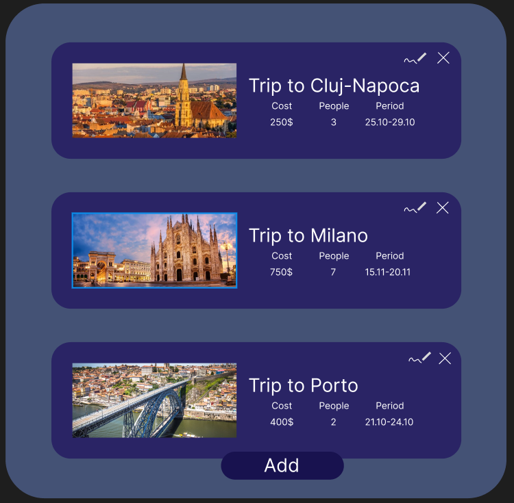
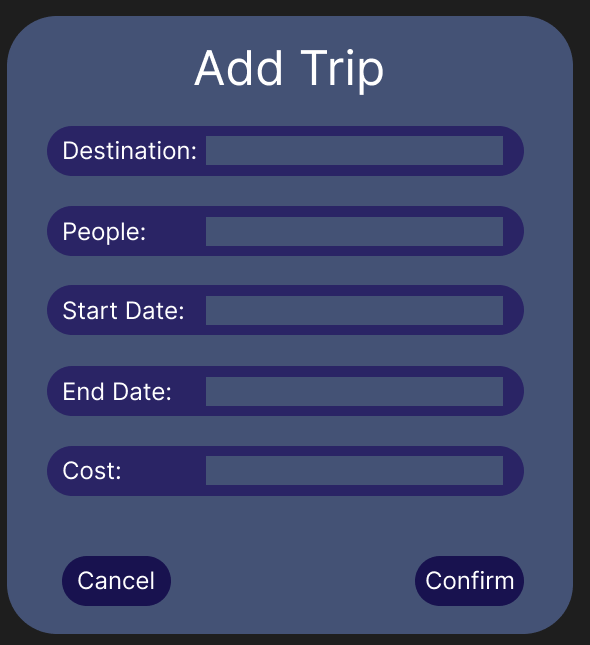

# Mobile-Applications
The application will be used to keep track of a persons planned trips to different cities. You will be able to add or modify trips at all time as well as view past trips. Each trip will contain additional details such as the period it takes place in and its cost.
The main entity will be the trips themselves, which contain a field for the name of the destination, one for start and end date each, one for the cost in dollars, one for the amount of people going and an id. An additional table could be added with the details about the people that are going.
When creating an entity all the previously specified fields need to be added except the id and the confirm button be pressed for it to be persisted. Reading will be done automatically when opening an application and after modifying anything, then the entities displayed on the main page. When deleting, there will be an “x” button next to each entity which will simply remove it. Updating will be done in a similar name to addition, but a button next to the delete one needs to be pressed, also the name of the destination cannot be changed.
All crud operations except the read should be persisted on the local database. There will also be another simple persisted operation to mark a trip as completed.
When creating, if the user is offline, the app will store the created entity locally and add the new item to the database once it regains connectivity. If any problems arise when reading the app will simply display a message that the data cannot be retrieved or display one or more placeholder item in case some of them can still be shown. When updating, behavior will be similar to adding meaning the information will be stored and synced one online. When deleting the item will be removed for the list locally and the same will be done from the database once able to.

Img 1. Main Page Mockup
 
Img 2. Add Page Mockup
  
